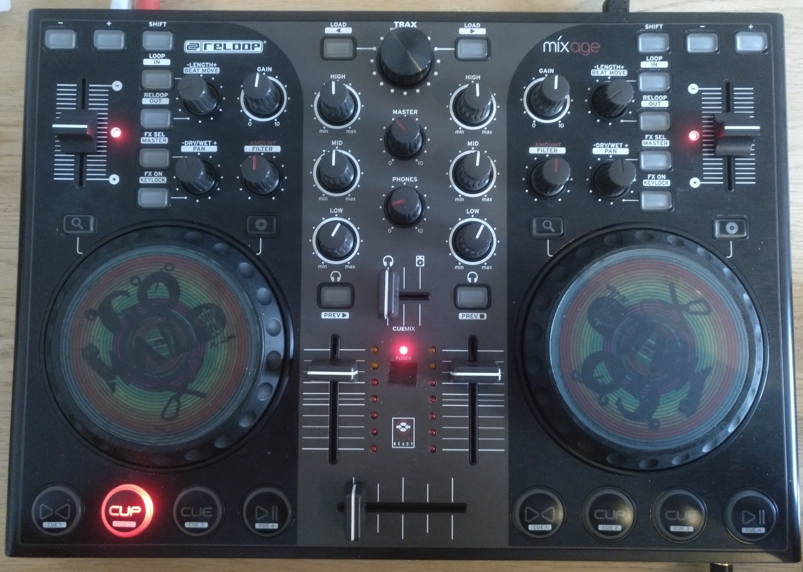

# Mixxx 2.1+ Reloop Mixage IE controller mappings

Controller mappings for the Reloop Mixage IE DJ controller to be used in Mixxx. They should work for the non-IE version too. Most controls (~95%) are mapped including some shift versions, LEDs and VU-meters are properly updated. Effect controls (dry / wet + super) are available for effect rack 1 & 2.
Read [here](https://www.mixxx.org/forums/viewtopic.php?f=7&t=7263) how to use the mapping files in Mixxx. Make sure you copy both the XML and JS file to your controller directory.

## Controls

Some functions on this controller are self-explanatory and mapped in that way. The others are explained here:

### Decks / Effects

| Control                 | Function                                                     | Shift function                          |
| ----------------------- | ------------------------------------------------------------ | --------------------------------------- |
| **- / +**               | Nudge deck while playing (slower / faster)                   | -                                       |
| **LOOP / IN**           | Set loop start at current play position and turn loop on     | -                                       |
| **RELOOP / OUT**        | Toggle loop on / off                                         | -                                       |
| **FX SEL / MASTER**     | Toggle effect racks applied to deck N (effect 1 ➝ 2 ➝ 1+2 ⮌) | Toggle effect rack N enabled for master |
| **FX ON / KEYLOCK**     | Toggle effect racks enabled for deck N                       | Beat-sync deck                          |
| **-LENGTH+ / BEATMOVE** | Halve / double loop lenght                                   | Shift loop by two beats left / right    |
| **-DRY/WET+ / PAN**     | Control dry / wet for effect rack N                          | Control super knob for effect rack N    |
| **AMOUNT / FILTER**     | Control quick effect (can be changed in settings) super knob | -                                       |
| **Loupe icon**          | Hold to use wheel to scroll through library                  | -                                       |
| **Disc icon**           | Hold to use wheel to scratch deck N                          | -                                       |
| **Headphone icon**      | Route deck N audio to heaphones                              | -                                       |
| **\><**                 | Jumps to the cue point if one is set                         | -                                       |
| **CUP**                 | plays from the cue point if set                              | -                                       |
| **CUE**                 | sets a cue point at the current play position                | -                                       |
| **\>=**                 | Play / pause                                                 | -                                       |

### General

| Control      | Function                                                    | Shift function |
| ------------ | ----------------------------------------------------------- | -------------- |
| **LOAD / <** | Load selected track from library into deck 1                | -              |
| **TRAX**     | Turn to browse library. Press to play / pause track preview | -              |
| **LOAD / >** | Load selected track from library into deck 2                | -              |

Scrolling the library will resize it and hide the decks for better browsing. The decks will be shown again after 4s, or when selecting a song into a deck.

I found a bug or have a suggestion
========
The best way to report a bug or suggest something is to post an issue on GitHub. Try to make it simple, but descriptive and add ALL the information needed to REPRODUCE the bug. **"Does not work" is not enough!** If you can not compile, please state your system, compiler version, etc! You can also contact me via email if you want to.
