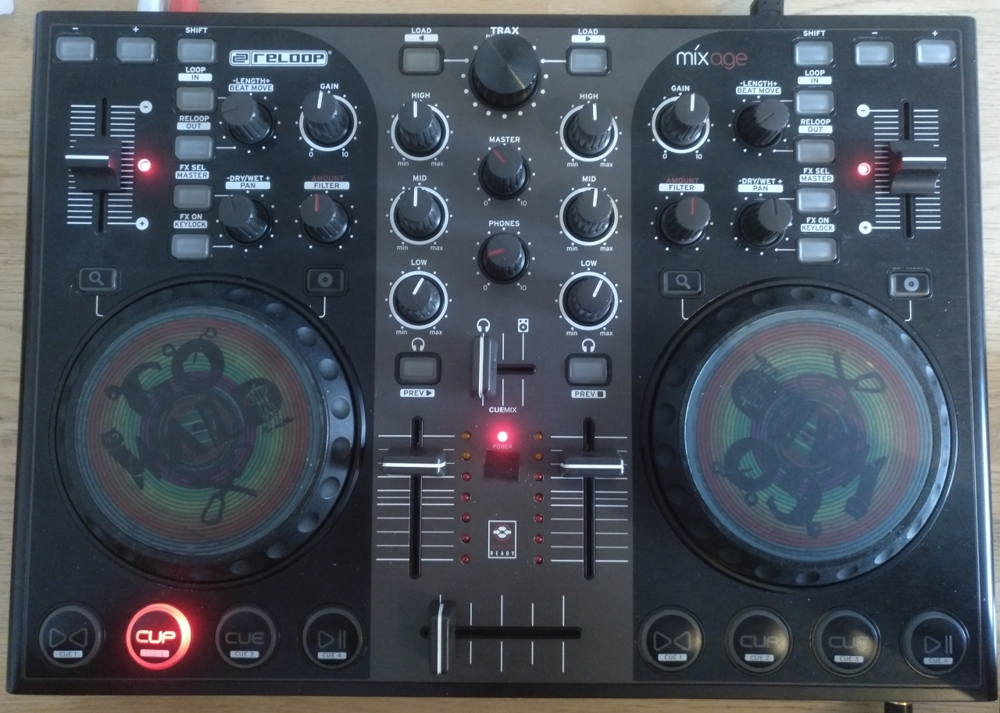

# !!! OUTDATED !!!
See [my mixxx fork](https://github.com/HorstBaerbel/mixxx/tree/reloop_mixage) and my [mixxx manuals fork](https://github.com/HorstBaerbel/manual/tree/2.3) for the most current version of the mappings.

## Reloop Mixage IE controller mappings

Controller mappings for the Reloop Mixage Interface Edition DJ controller to be used in Mixxx. They should work for the non-IE version too. All controls are mapped including shift versions, LEDs and VU-meters are properly updated. Effect controls (dry / wet + super) are available for effect rack 1 & 2.
Read [here](https://www.mixxx.org/forums/viewtopic.php?f=7&t=7263) how to use the mapping files in Mixxx. Make sure you copy both the XML and JS file to your controller directory. Mixxx 2.1+ is needed.

## Audio

This controller is a MIDI and audio class compliant device so it is compatible as-is with Linux, MacOS and Windows. On windows, the manufacturer ships an ASIO low-latency driver that can be found on the manufacturer’s product page

The **MIC 🎤** input can be set to different modes. To make it usable in Mixxx, set it to "SW". The **MASTER** and **PHONES** controls work directly on the audio hardware and can't be mapped in Mixxx.

## Controls

Most functions on this controller are self-explanatory and mapped in that way. The others are explained here:

### Decks / Effects

| Control                             | Function                                                                                                                              | Shift function                                           |
| ----------------------------------- | ------------------------------------------------------------------------------------------------------------------------------------- | -------------------------------------------------------- |
| **- / +**                           | Nudge deck while playing (slower / faster)                                                                                            | -                                                        |
| **LOOP / IN**                       | Set beatloop start at current play position and turn beatloop on                                                                      | Set loop in point                                        |
| **RELOOP / OUT**                    | Toggle relooping on / off                                                                                                             | Set loop out point                                       |
| **FX SEL / MASTER**                 | Toggle which effect racks are applied to deck N (effect rack 1 ➝ 2 ➝ 1+2 ⮌)                                                           | Toggle if effect rack N is enabled for master            |
| **FX ON / KEYLOCK**                 | Toggle if effect racks are enabled for deck N                                                                                         | Toggle keylock (keep pitch on speed change) on / off     |
| **-LENGTH+ / BEATMOVE**             | Halve / double loop lenght (push knob to adjust move length instead)                                                                  | Shift loop by move length beats left / right             |
| **-DRY/WET+ / PAN**                 | Control dry / wet for effect rack N                                                                                                   | Control super knob for effect rack N                     |
| **AMOUNT / FILTER**                 | Control quick effect (can be changed in settings) super knob                                                                          | -                                                        |
| **Loupe icon 🔍**                    | Hold to use wheel to scroll through library                                                                                           | -                                                        |
| **Disc icon 💿**                     | Hold to use wheel to scratch deck                                                                                                     | -                                                        |
| **Left headphone icon 🎧 / PREV ▶️**  | Route deck 1 audio to headphones                                                                                                      | Play / stop preview deck                                 |
| **Right headphone icon 🎧 / PREV ◼️** | Route deck 2 audio to headphones                                                                                                      | Stop preview deck                                        |
| **▶️◀️ / CUE 1**                      | Beat-sync deck as follower (hold to sync lock)                                                                                        | If hot cue 1 is set, go to hot cue 1, else set hot cue 1 |
| **CUP / CUE 2**                     | If at cue point, play when released. If not at cue point, sets a cue point                                                            | If hot cue 2 is set, go to hot cue 2, else set hot cue 2 |
| **CUE / CUE 3**                     | If at cue point, plays until released. If not at cue point: If playing, goes to cue point and stops. If not playing, sets a cue point | If hot cue 3 is set, go to hot cue 3, else set hot cue 3 |
| **⏯ / CUE 4**                       | Play / pause                                                                                                                          | If hot cue 4 is set, go to hot cue 4, else set hot cue 4 |

The effect buttons and knobs on the left side apply to Effect Rack 1, the ones on the right to Effect Rack 2.

### General

| Control      | Function                                                    | Shift function                                        |
| ------------ | ----------------------------------------------------------- | ----------------------------------------------------- |
| **LOAD / ◀️** | Load selected track from library into deck 1                | Load selected track from library into deck 1 and play |
| **TRAX**     | Turn to browse library. Press to play / pause track preview | -                                                     |
| **LOAD / ▶️** | Load selected track from library into deck 2                | Load selected track from library into deck 2 and play |

Scrolling the library will resize it and hide the decks for better browsing. The decks will be shown again after 4s, or when selecting a song into a deck.

I found a bug or have a suggestion
========
The best way to report a bug or suggest something is to post an issue on GitHub. Try to make it simple, but descriptive and add ALL the information needed to REPRODUCE the bug. **"Does not work" is not enough!** If you can not compile, please state your system, compiler version, etc! You can also contact me via email if you want to.
